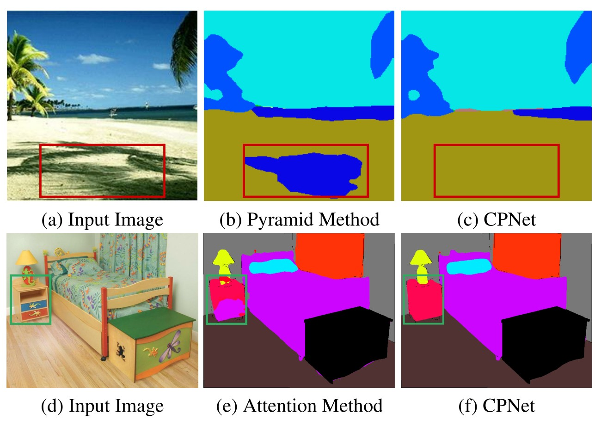
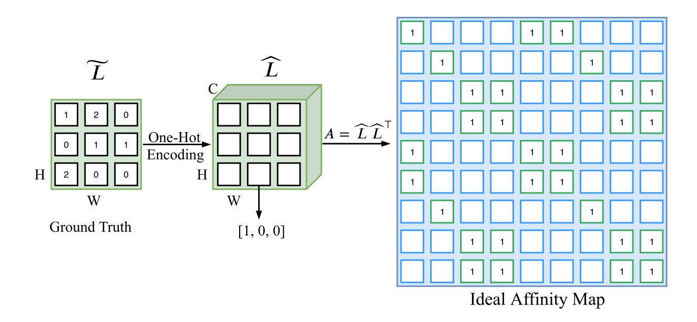
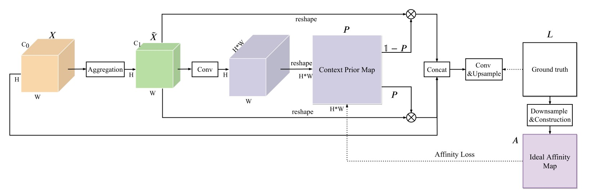
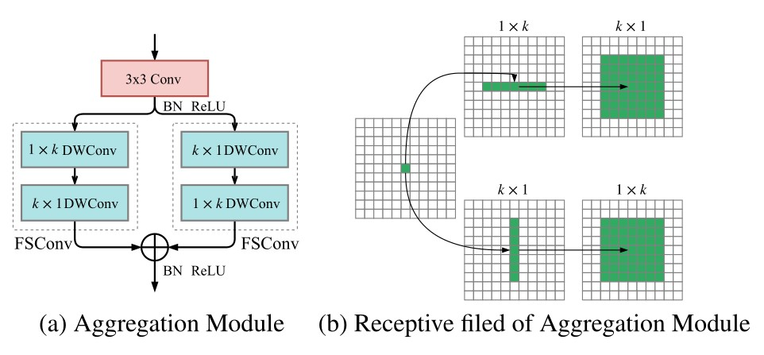
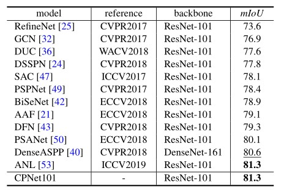

> 论文原文：[2004.01547.pdf ](https://arxiv.org/pdf/2004.01547.pdf)

### 简介

这篇文章主要讨论了上下文先验在场景分割的应用，发表于CVPR2020。

- **Motivation**

由于卷积层结构的限制，FCN提供的上下文信息不足，有待改进。因此，近年来各种方法被提出来用于探索上下文依赖性，以获得更准确的分割结果。目前为止，上下文信息的聚合主要有两种方法:

**基于金字塔的方法：**
有几种方法如PSPNet采用基于金字塔的模块或全局池化来有规律的聚合区域或全局上下文信息。然而，它们捕获了同类的上下文关系，却忽略了不同类别的上下文。如图1(b)示。当场景中有混淆的类别时，这些方法可能导致不太可靠的上下文。

**基于注意力的方法：**
最近基于注意力的方法，如通道注意力、空间注意力，有选择地聚合不同类别之间的上下文信息。然而，由于缺乏明确的区分，注意力机制的关系描述不够清晰。因此，它可能会选择不需要的上下文依赖关系，如图1(e)所示。

这两种方法聚合上下文信息，没有明显的区别类内和类间上下文 ，导致了不同上下文关系的混合。

为了去解决这些问题，在这篇文章中，先提出一个**Context Prior**去对相同类(**intra-context**)的像素与不同类(**inter-context**)的像素之间的关系进行建模。基于**Context Prior**，提出了**Context Prior Network**，它包含了受**Affinity Loss**监督的**Context Prior Layer**。

### Affinity Loss

为了去明确规范这个网络去学习类别之间的关系，我们引入了Affinity Loss。对于图像上的每一个像素，**Affinity Loss将会迫使网络去考虑在同一类别的像素和不同类别的像素**。

只要给定输入的**Groundtruth**，我们就可以知道每一个像素的`Context Prior`（哪些属于同一类，哪些属于不同类），可以学习`Context Prior`去引导整个网络。首先根据**ground truth**建立**Ideal Affinity Map**作为监督：

给定输入图像$I$和其对应的groundtruth$L$，将 $I$ 送入网络中可以得到一个大小为$H\times W$的特征图$X$。我们先将$L$下采样到与$X$大小相同，得到一个更小的groundtruth $ \tilde{L}  $。我们使用了$one-hot$编码去对$\tilde{L}$中的类别标签进行编码，得到一个大小为$H\times W\times C$的矩阵$\hat{L}$， $C$为类别数。紧接着，将$L$ Reshape成$N\times C$大小，$N=H\times W$。最后，我们进行一个矩阵乘法：$A = L\times L^{T} $，这个A就是我们期望的$Ideal \ Affinity \ Map$，大小为$N\times N$。 我们使用$Ideal\ Affinity\ Map$去监督$Context\ Prior\ Map$的生成。

对于$Context\ Prior\ Map$中的每一个像素，其实是一个二分类问题。通常解决二分类问题用到的是二元交叉熵损失：
$$
\mathcal{L}\_{u}=-\frac{1}{N^{2}}(a_{n}\log{p_{n}}+(1-a_{n})\log{(1-p_{n})}).
$$

其中$\{p_{n}\in P,n\in [1,,N^{2}]\}$，$P$为预测得到的$Prior \ map$，$\{a_{n}\in A,n\in [1,,N^{2}]\}$，$A$为期望得到的$Ideal\ Affinity\ Map$。

> ❝ However, such a unary loss only considers the isolated pixel in the prior map ignoring the semantic correlation with other pixels.

但是它只考虑了在$Prior \ map$中的单个像素，忽略了与其他像素的语义联系。所以需要另外一部分损失。我们可以在$A$中看到每一行其实都对应着feature map X中的每个像素，可以它们表示为同类像素或者不同类像素，这个关系是有助于推理语义相关性和场景结构的。因此，我们考虑把同类像素和不同类像素作为两个部分来对关系分别编码：
$$
\begin{gathered}
\mathcal{T}\^{p}\_{j}=\log\frac{\sum_{i=1}^{N}a_{ij}p_{ij}}{\sum_{i=1}^{N}p_{ij}},\cr
\mathcal{T}^{r}_{j}=\log\frac{\sum_{i=1}^{N}a_{ij}p_{ij}}{\sum_{i=1}^{N}a_{ij}},\cr
\mathcal{T}^{s}_{j}=\log\frac{\sum_{i=1}^{N}(1-a_{ij})(1-p_{ij})}{\sum_{i=1}^{N}(1-a_{ij})},\cr
\mathcal{L}_{g}=-\frac{1}{N}\sum_{j=1}^{N}(\mathcal{T}^{p}_{j}+\mathcal{T}^{r}_{j}+\mathcal{T}^{s}_{j})
\end{gathered}
$$

其中，$\mathcal{T}\_{j}^{p}$、$\mathcal{T}\_{j}^{r}$、$\mathcal{T}_{j}^{s}$分别表示$P$中第$j$行的同类准确率(precision)，同类召回率(recall)，特异度(specificity)。

最后，完整的Affinity Loss定义如下：
$$
\mathcal{L}\_{p}=\lambda_{u}\mathcal{L}_{u}+\lambda_{g}\mathcal{L}_{g}.
$$
其中，$\lambda_{u}$和$\lambda_{g}$用于平衡一元损失(unary loss)和全局损失(global loss)，根据经验，通常都是直接设为1。

### 网络结构(Context Prior Layer)

作者设计上下文先验层（**Context Prior Layer**），它可以在任何backbone的最后插入以进行语义分割的任务。**Context Prior Layer**使用backbone如resnet50输出的特征图（图中最左边的黄色立体）作为输入特征$X$，形状为$H\times W\times C_{0}$。经过聚合模块 `Aggregation`聚合局部上下文信息之后，得到$\tilde{X}$，送入一个$1\times1$卷积层+BN+sigmoid层进行处理，形状变为$H\times  W\times N(N=H\times W)$，最后进行reshape得到了`Context Prior Map`。`Context Prior Map`由`GT`产生的`Ideal Affinity Map`进行监督，学习得到了类内的上下文信息。将他与经过聚合后的特征图相乘后得到富含类内上下文信息的特征图。与此同时，用1-P得到可以得到类间上下文，同样的操作可以得到富含类间上下文信息的特征图。将原图和两种上下文Concat去输出最终的预测$F=Concat(X,Y,Y^{-})$

### Aggregation Module

**Context Prior Map**需要一些局部空间信息去推理语义相关性，一般来说要聚合更多的空间信息就要使用更大的卷积核，但是计算代价是很大的。因此，作者用全分离卷积(**fully separable convolution**)设计了一个有效的**Aggregation Module**去聚合空间信息。

我们将一个普通卷积分解成两个在空间上不对称的卷积，比如一个$k\times k$的卷积，我们这样来替代：

先使用一个$k\times 1$卷积，接着再使用一个$1\times k$卷积，我们称为空间可分离卷积($spatial\ separable\ convolution$)，并且每个空间卷积都采用深度卷积($depth-wise convolution$)，这导致计算量大大减少。由于考虑了空间和深度两个维度，作者把这种方式称为$Fully\ Separable\ Convolution$。

### Network Architecure

Context Prior Network(CPNet)是一个全卷积网络，由Backbone和一个Context Prior Layer组成。Backbone是一个用了空洞卷积(dilation strategy)的现成网络。同时，在backbone网络的阶段4(stage 4)还使用了辅助损失(auxiliary loss)，也是一个交叉熵损失。最终的损失函数为：
$$
\mathcal{L}=\lambda_{s}\mathcal{L}_{s}+\lambda_{a}\mathcal{L}_{a}+\lambda_{p}\mathcal{L}_{p}
$$
其中$\mathcal{L}_{s}$, $\mathcal{L}_{a}$，$\mathcal{L}_{p}$ 分别代表主要分割损失(main segmentation loss)，辅助损失(auxiliary loss)以及Affinity Loss，$λs$, $λa$, $λp$ 是用来平衡loss的权重。经验性地设置为：$λs=1, λa=1, λp=0.4$。

### 结果

