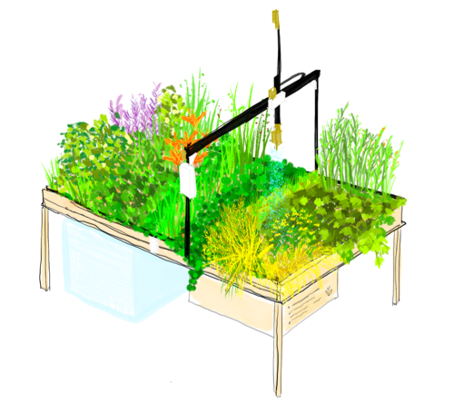

# AlphaGardenSim

AlphaGardenSim is a fast, first order open-access simulator that integrates single plant growth models with inter-plant 
competition for sun light and water. The aim of the simulator is to support learning a control policy for cultivating
a polyculture garden. More on this [here](https://goldberg.berkeley.edu/art/AlphaGarden/). 
The simulator implements a custom [OpenAI gym](https://gym.openai.com/) reinforcement learning environment for this 
polyculture farming setup. More on the simulator can be found in the [paper]().



### Table of Contents
**[Installation Instructions](#installation-instructions)**<br>
**[Usage Instructions](#usage-instructions)**<br>
**[Troubleshooting](#troubleshooting)**<br>
**[Notes and Miscellaneous](#notes-and-miscellaneous)**<br>
**[Next Steps, Acknowledgements, Feedback, License](#next-steps)**<br>

## Installation Instructions and Quickstart

For now the *AlphaGardenSim* module is distributed with two parts: [Learning](https://github.com/BerkeleyAutomation/AlphaGarden/Learning) 
containing the *simalphagarden* and *wrapperenv* packages and [Simulator](https://github.com/BerkeleyAutomation/AlphaGarden/Simulator) 
containing the *simulator* package.

Install the required pip packages and the mentioned packages from above:

1. `git clone` the repository
2. Open the `AlphaGarden` repository 
3. Run ```pip install -r requirements.txt ``` inside [AlphaGarden](https://github.com/BerkeleyAutomation/AlphaGarden/). 

To run the simulator and collect data:

4. Move to the Learning folder with `cd Leaning/`
5. Run `python data_collection.py`

See the **[Usage Instructions](#usage-instructions)** for more details on how to use the simulator.

### Tests

Currently no tests are included. Tests may be added in the future.

### Built With

* [gym](https://gym.openai.com/) - Toolkit for developing and comparing reinforcement learning algorithms
* [TODO add other]

## Usage Instructions

The simulator models the inter-plant dynamics and competition for light and water. A main idea is to use the simulator
to learn a control policy for the garden that is reliable and sustainable.

### General Information

In the following important variables from *AlphaGarden* are listed:

* The garden is modeled as a discrete MxN grid
* Time *t* is specified in units of days
* *p(x,y)* in the garden contains up to one seed, and up to a fixed capacity of water.
* *D(k)* as a set of *k* plant types available in the garden, as well as types soil and unknown
* Vector **d**_(x,y,t)_ of length k representing the distribution of the plant (or soil) type that is visible overhead at point p(x, y)
* Seed locations in the garden **s(x,y)**
* Health of the plant at point *p(x, y)* at time t as *h(x,y,t)*
* Amount of soil moisture available at point *p(x,y)* at time *t* *w(x,y,t)*
* Vector **p**_(k, t)_ holds the global population in the garden as a distribution over point types D
* *c(t)* is the total canopy coverage w.r.t. the garden size at time *t*
* *v(t)* is the diversity in the garden at time *t*
* *s(t)* represents the sustainability in the garden

### Simulation Experiments

To run your own experiments or reproduce the experiments from the paper follow these instructions.

* Some of the parameters described in the experimental setup are stored in the [sim_global.py](https://github.com/BerkeleyAutomation/AlphaGarden/Simulator/simulator/sim_globals.py) file 

* Experimental data cna be generated with the data_collection module. Further parameters are defined in this file.

* List of 13 edible plant types used with different germination times, maturation times and growth rates, sampled from plant-specific Gaussian distributions.
Plants are modeled with the [Plant](https://github.com/BerkeleyAutomation/AlphaGarden/Simulator/simulator/plant.py) class and the data can be found [here](https://github.com/BerkeleyAutomation/AlphaGarden/Simulator/simulator/plant_presets.py)

| Plant Type      | Mean Germination Time (days)  | Mean Maturation Time (days)  | Mean Mature Radius (inches) | k<sub>1</sub> | k<sub>2</sub> |
| --------------- |:-----------------------------:|:----------------------------:|:---------------------------:|:-------------:| -------------:|
| Bok Choy        |7.5                            |45                            |3                            |0.33           |0.389          |
| Basil           |7.5                            |62.5                          |4.5                          |0.33           |0.389          |
| Lavender        |17.5                           |145                           |10.5                         |0.428          |0.455          |
| Parsley         |24.5                           |80                            |5.25                         |0.33           |0.389          |
| Sage            |15.5                           |730                           |15                           |0.428          |0.455          |
| Chives          |18                             |90                            |3.75                         |0.33           |0.389          |
| Cilantro        |8.5                            |67.5                          |2                            |0.33           |0.389          |
| Dill            |8.5                            |70                            |6.75                         |0.33           |0.389          |
| Fennel          |10                             |65                            |5.5                          |0.33           |0.389          |
| Nasturtium      |11                             |60                            |5.5                          |0.428          |0.455          |
| Marigold        |7.5                            |50                            |3.5                          |0.267          |0.38           |
| Calendula       |8.5                            |50                            |6                            |0.267          |0.38           |
| Borage          |10                             |56                            |10                           |0.267          |0.38           |
| Generic invasive| | | | |
| ...     | ... |... |... |... | ... |

### Evaluation

## Troubleshooting

## Notes and Miscellaneous

## Next Steps

* We plan to refactor the code and repackage the distribution.
* In future work, we will tune the simulator with measurements from a real garden, and use the learned policy to bootstrap a reinforcement learning policy.

## Acknowledgements

This research was performed at the AUTOLAB at UC Berkeley in affiliation with the Berkeley AI Research (BAIR) Lab, Berkeley Deep Drive (BDD), 
the Real-Time Intelligent Secure Execution (RISE) Lab, and the CITRIS ”People and Robots” (CPAR) Initiative. 
This research was supported in part by the RAPID: Robot-Assisted Precision Irrigation Delivery Project (USDA 2017-67021-25925 
under NSF National Robotics Initiative). The authors were supported in part by donations from Siemens, Google, Toyota Research Institute,
Honda Research, and Hewlett-Packard. We thank our colleagues who provided helpful feedback and suggestions, in particular Mary Power, 
Jackson Chui, Jeff Ichnowski, Micah Carroll, Paul Shao, Eric Siegel, Isaac Blankensmith, Maya Man, Sarah Newman, Shubha Jagannatha, 
Sona Dolasia, Christiane Paul, Vishal Satish and Atsunobu Kotani.

## Feedback

## License

### Code

### Images
